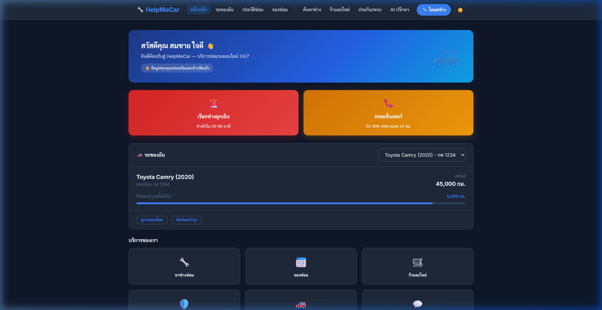
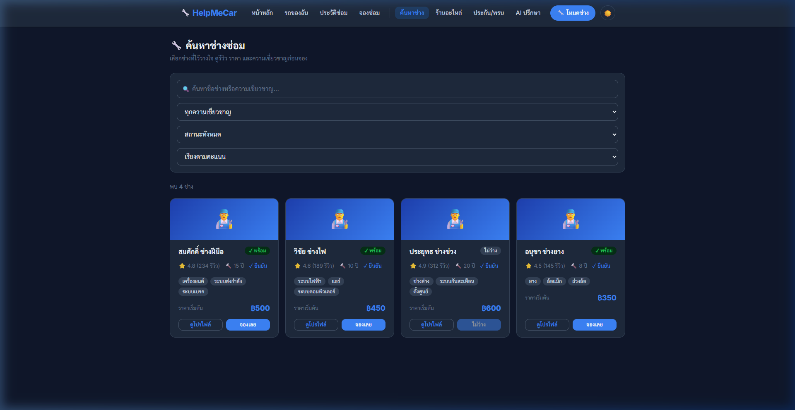

# 🔧 HelpMeCar — บริการช่างซ่อมรถออนไลน์ 24/7

แพลตฟอร์มเว็บสำหรับเรียกช่างซ่อมรถฉุกเฉิน จัดการรถยนต์ ดูประวัติการซ่อม สั่งซื้ออะไหล่ และปรึกษา AI เกี่ยวกับปัญหารถ

🔗 **Demo:** [kittiphongkubkub.github.io/HelpMeCar](https://kittiphongkubkub.github.io/HelpMeCar/)

---

## 📸 ตัวอย่างหน้าเว็บ

| แดชบอร์ดผู้ใช้ | ค้นหาช่างซ่อม |
|:-:|:-:|
|  |  |

---

## ✨ ฟีเจอร์หลัก

| ฟีเจอร์ | รายละเอียด |
|--------|-----------|
| 🚨 เรียกช่างฉุกเฉิน | ช่างมาถึงภายใน 30–60 นาที |
| 🚛 เรียกรถลาก | บริการฉุกเฉิน 24/7 ภายใน 10–30 นาที |
| 🔧 ค้นหาช่างซ่อม | เลือกช่างที่เหมาะสมกับปัญหา |
| 🛒 ร้านอะไหล่ | สั่งซื้ออะไหล่ที่เข้ากับรถของคุณ |
| 📋 ประวัติการซ่อม | บันทึกการซ่อมและค่าใช้จ่าย |
| 💬 AI ปรึกษา | วินิจฉัยปัญหารถด้วย AI |
| 📅 การจอง | นัดหมายซ่อมบำรุงล่วงหน้า |
| 🌙 Dark Mode | รองรับโหมดมืด |

## 📁 โครงสร้างโปรเจก

```
HelpMeCar-main/
├── index.html                  # หน้าแดชบอร์ดหลัก (ผู้ใช้)
├── css/
│   └── style.css               # สไตล์ทั้งหมด
├── js/
│   ├── app.js                  # Logic หลัก (theme, auth)
│   └── dashboard.js            # Logic แดชบอร์ด
├── pages/
│   ├── login.html              # หน้าเข้าสู่ระบบ
│   ├── vehicles.html           # จัดการรถยนต์
│   ├── booking.html            # การจองช่าง
│   ├── history.html            # ประวัติการซ่อม
│   ├── mechanics.html          # ค้นหาช่าง
│   ├── tow-service.html        # บริการรถลาก
│   ├── store.html              # ร้านอะไหล่
│   ├── consultation.html       # AI ปรึกษา
│   ├── mechanic-dashboard.html # แดชบอร์ดช่าง
│   ├── mechanic-jobs.html      # งานของช่าง
│   ├── mechanic-job-detail.html# รายละเอียดงาน
│   └── terms.html              # ข้อกำหนดการใช้งาน
└── docs/                       # เอกสารเพิ่มเติม
```

## 🛠️ Tech Stack

- **HTML5** — โครงสร้างและ Semantic Markup
- **CSS3** — CSS Variables, Glassmorphism, Dark Mode, Animation
- **Vanilla JavaScript** — Logic หน้าต่าง ๆ, Theme Toggle, LocalStorage

## 📱 หน้าต่าง ๆ

### สำหรับผู้ใช้ (ลูกค้า)
| หน้า | URL |
|-----|-----|
| แดชบอร์ด | `index.html` |
| จัดการรถ | `pages/vehicles.html` |
| จองช่าง | `pages/booking.html` |
| ประวัติซ่อม | `pages/history.html` |
| ค้นหาช่าง | `pages/mechanics.html` |
| รถลาก | `pages/tow-service.html` |
| ร้านอะไหล่ | `pages/store.html` |
| ปรึกษา AI | `pages/consultation.html` |

### สำหรับช่าง
| หน้า | URL |
|-----|-----|
| แดชบอร์ดช่าง | `pages/mechanic-dashboard.html` |
| รายการงาน | `pages/mechanic-jobs.html` |
| รายละเอียดงาน | `pages/mechanic-job-detail.html` |

## 🚀 วิธีใช้งาน

1. Clone หรือดาวน์โหลดโปรเจก
2. เปิดไฟล์ `index.html` ในเบราว์เซอร์
3. ข้อมูลจะถูกเก็บใน **LocalStorage** ของเบราว์เซอร์
4. ไม่ต้องติดตั้ง Backend หรือ Database เพิ่มเติม

---

**© 2026 HelpMeCar** | พัฒนาโดย Kittiphong Toadonthong
