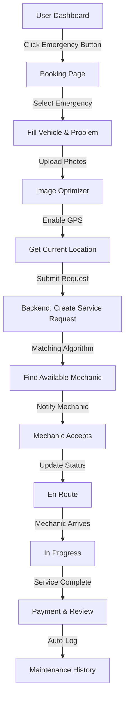
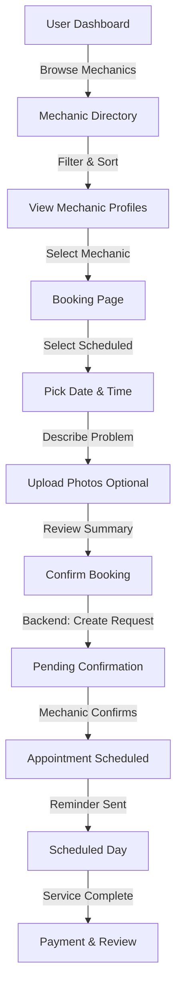
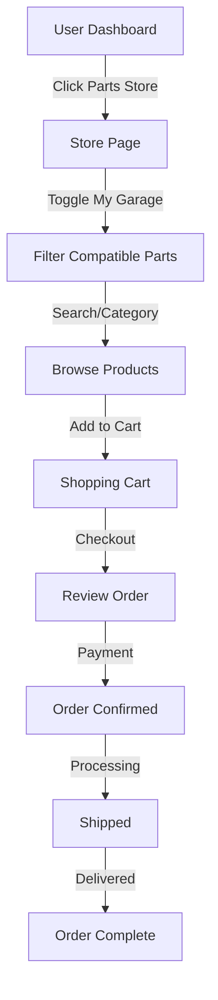
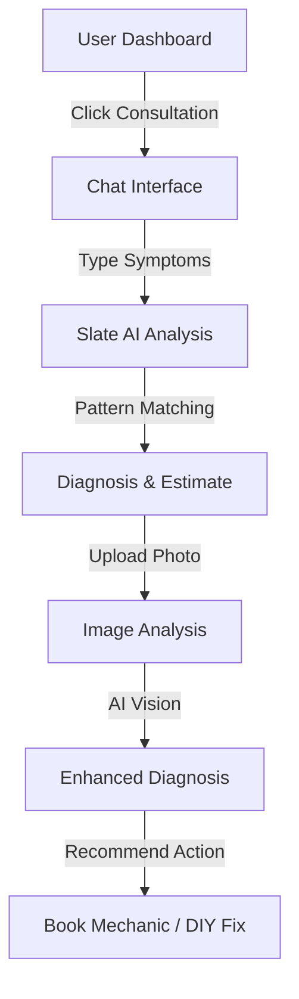

# FarMyKixFixMyCar - System Architecture & Flow

## System Overview

FarMyKixFixMyCar is a Progressive Web Application (PWA) that connects vehicle owners with mechanics through a sophisticated matching system, providing 24/7 on-demand and scheduled services.

---

## Architecture Layers

### 1. Frontend Layer (Current Implementation)
**Technology:** Vanilla HTML5, CSS3, JavaScript ES6+

**Components:**
- **Design System** (`style.css`)
  - Blue-Grey color scheme
  - Thai font support (Sarabun)
  - Responsive grid system
  - Component library (buttons, cards, forms, modals)

- **Core JavaScript** (`app.js`)
  - State management
  - Mock data layer
  - Utility functions
  - Navigation controls

- **Page Modules:**
  - `index.html` + `dashboard.js` - User dashboard
  - `mechanics.html` - Mechanic directory
  - `store.html` + `store.js` - Parts e-commerce
  - `history.html` - Service history
  - `consultation.html` + `chat.js` - AI consultant
  - `booking.html` - Service booking
  - `login.html` - Authentication
  - `terms.html` - Legal documents

- **Utilities:**
  - `imageOptimizer.js` - Client-side image compression

### 2. Backend Layer (Planned)
**Recommended Stack:** Node.js + Express.js

**Services:**
- **Authentication Service:** JWT-based auth, session management
- **User Service:** Profile management, role handling
- **Booking Service:** Request handling, mechanic matching algorithm
- **Payment Service:** Integration with payment gateway (Stripe/Omise)
- **Notification Service:** SMS, Email, Push notifications
- **AI Service:** Integration with OpenAI API for Slate consultant
- **Storage Service:** Image/video upload to cloud storage (AWS S3/Google Cloud Storage)

### 3. Database Layer
**Recommended:** PostgreSQL or MySQL

**Schema:** See `database-schema.md` for complete definitions

**Key Tables:**
- Users (dual role: owners & mechanics)
- Vehicles
- Mechanic_Profiles
- Service_Requests
- Maintenance_Logs
- Parts_Store
- Order_Items
- Reviews_Ratings

### 4. External Services

**Payment Gateway:**
- Omise (Thailand-specific) or Stripe
- Escrow system to hold payments until service completion

**Maps & Location:**
- Google Maps API for location services
- Geolocation API for real-time tracking

**Cloud Storage:**
- AWS S3 or Google Cloud Storage
- For storing optimized vehicle images, service photos

**AI/ML Services:**
- OpenAI GPT-4 for enhanced Slate consultant
- Image recognition for automated damage assessment

**SMS/Email:**
- Twilio for SMS notifications
- SendGrid for email services

---

## User Flows

### Flow 1: Emergency Service Request



### Flow 2: Scheduled Appointment



### Flow 3: Parts Store Purchase



### Flow 4: AI Consultation



---

## Data Flow Architecture

### Request-Response Cycle

```
┌─────────────┐      HTTP/HTTPS     ┌──────────────┐
│   Browser   │ ◄─────────────────► │  Web Server  │
│  (Client)   │     JSON/REST       │  (Express)   │
└─────────────┘                     └──────────────┘
      │                                    │
      │                                    │
      ▼                                    ▼
┌─────────────┐                     ┌──────────────┐
│ LocalStorage│                     │   Database   │
│  (Session)  │                     │ (PostgreSQL) │
└─────────────┘                     └──────────────┘
                                           │
                                           │
                                           ▼
                                    ┌──────────────┐
                                    │ External APIs│
                                    │ Payment/Maps │
                                    └──────────────┘
```

### Image Upload Flow

```
┌────────────┐     Select     ┌───────────────┐
│ User Input │ ────────────►  │ File Picker   │
└────────────┘   Image File   └───────────────┘
                                      │
                                      ▼
                               ┌───────────────┐
                               │Image Optimizer│
                               │ (Client-Side) │
                               └───────────────┘
                                      │
                    ┌─────────────────┼─────────────────┐
                    │                 │                 │
                    ▼                 ▼                 ▼
            ┌──────────────┐  ┌──────────────┐  ┌──────────────┐
            │ Resize       │  │ Compress     │  │ Convert      │
            │ (Max 1200px) │  │ (Quality 0.8)│  │ (to WebP)    │
            └──────────────┘  └──────────────┘  └──────────────┘
                    │                 │                 │
                    └─────────────────┼─────────────────┘
                                      │
                                      ▼
                               ┌───────────────┐
                               │Upload to API  │
                               └───────────────┘
                                      │
                                      ▼
                               ┌───────────────┐
                               │Cloud Storage  │
                               │   (AWS S3)    │
                               └───────────────┘
```

---

## Security Architecture

### Authentication Flow

```
1. User Login
   ├─► Frontend validates inputs
   ├─► POST /api/auth/login
   ├─► Backend verifies credentials (bcrypt hash)
   ├─► Generate JWT token
   ├─► Return token + user data
   └─► Store in localStorage (with expiry)

2. Protected Routes
   ├─► Intercept API requests
   ├─► Attach Authorization: Bearer <token>
   ├─► Backend verifies JWT signature
   ├─► Check token expiry
   └─► Grant/Deny access
```

### Data Protection

**Frontend:**
- HTTPS only (SSL/TLS encryption)
- Input validation & sanitization
- XSS protection (escape user inputs)
- CSRF tokens for state-changing operations

**Backend:**
- Password hashing (bcrypt with salt)
- Rate limiting (prevent brute force)
- SQL injection prevention (parameterized queries)
- Role-based access control (RBAC)

**Database:**
- Encrypted connections
- Regular backups
- Sensitive data encryption at rest

---

## Matching Algorithm

### Mechanic Selection Logic

```javascript
function findBestMechanic(request) {
  // Step 1: Filter available mechanics
  let candidates = mechanics.filter(m => 
    m.is_available && 
    m.specializations.includes(request.category)
  );
  
  // Step 2: Calculate proximity score
  candidates = candidates.map(m => ({
    ...m,
    distance: calculateDistance(request.location, m.current_location)
  }));
  
  // Step 3: Filter by max distance (20km for emergency)
  if (request.service_type === 'emergency') {
    candidates = candidates.filter(m => m.distance <= 20);
  }
  
  // Step 4: Calculate composite score
  candidates = candidates.map(m => ({
    ...m,
    score: (
      (5 - m.distance / 10) * 0.4 +  // Proximity: 40%
      m.average_rating * 0.3 +        // Rating: 30%
      (m.total_jobs_completed / 100) * 0.2 + // Experience: 20%
      (5 - m.starting_price / 500) * 0.1     // Price: 10%
    )
  }));
  
  // Step 5: Sort by score (highest first)
  candidates.sort((a, b) => b.score - a.score);
  
  // Step 6: Return top 3 for user selection
  return candidates.slice(0, 3);
}
```

---

## Performance Optimizations

### Frontend

1. **Image Optimization:**
   - Client-side compression before upload
   - Lazy loading for image galleries
   - Thumbnail generation for previews
   - WebP format for 25-35% size reduction

2. **Code Splitting:**
   - Load page-specific JS only when needed
   - Defer non-critical scripts

3. **Caching Strategy:**
   - Service Worker for offline functionality
   - Cache static assets (CSS, JS, images)
   - Cache API responses (with TTL)

4. **Rendering:**
   - Virtual scrolling for long lists
   - Debouncing search inputs
   - Optimized DOM manipulation

### Backend

1. **Database:**
   - Indexed queries (see database-schema.md)
   - Connection pooling
   - Read replicas for heavy read operations
   - Query result caching (Redis)

2. **API:**
   - Response compression (gzip)
   - Pagination for large datasets
   - Rate limiting per user

3. **Infrastructure:**
   - CDN for static assets
   - Load balancing for horizontal scaling
   - Auto-scaling based on traffic

---

## Business Logic

### Payment Escrow System

```
1. Booking Created
   └─► Charge card (authorization hold)
   
2. Service In Progress
   └─► Funds held in escrow
   
3. Service Completed
   ├─► User confirms completion
   ├─► Release funds to mechanic (minus platform fee)
   └─► Log in Maintenance_Logs
   
4. Dispute Raised
   ├─► Hold funds
   ├─► Platform mediation
   └─► Resolve: refund or release
```

### Platform Revenue Model

- **Service Fee:** 15% commission on each completed job
- **Premium Subscription:** ฿299/month for unlimited AI consultations
- **Parts Store Markup:** 10-15% on parts sold
- **Featured Mechanic Listings:** ฿500/month for top placement

---

## Future Enhancements

1. **Mobile Apps:** Native iOS/Android apps with push notifications
2. **Live Tracking:** Real-time mechanic GPS tracking
3. **Video Calls:** Built-in video consultation with mechanics
4. **AI Damage Assessment:** Computer vision for automated damage analysis
5. **Mechanic Heatmap:** Demand forecasting for mechanics
6. **Fleet Management:** B2B solution for corporate vehicle fleets
7. **Insurance Integration:** Direct claims filing
8. **Multi-language:** English, Chinese support

---

**Document Version:** 1.0  
**Last Updated:** February 10, 2026  
**Author:** FarMyKixFixMyCar Development Team
